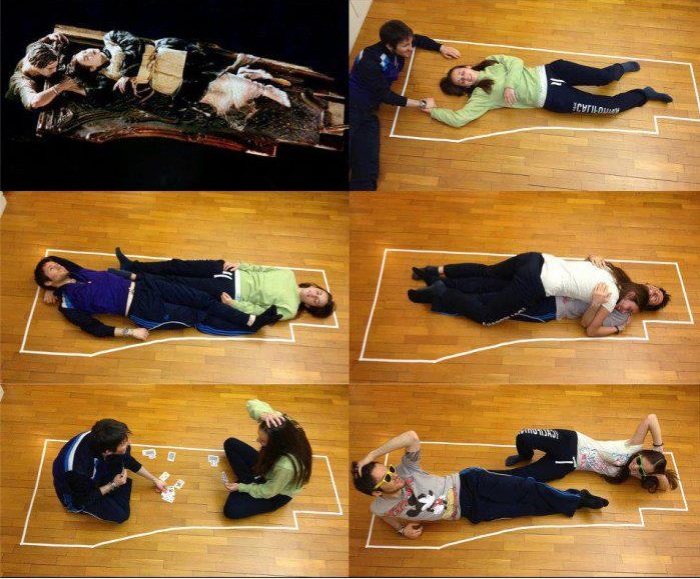
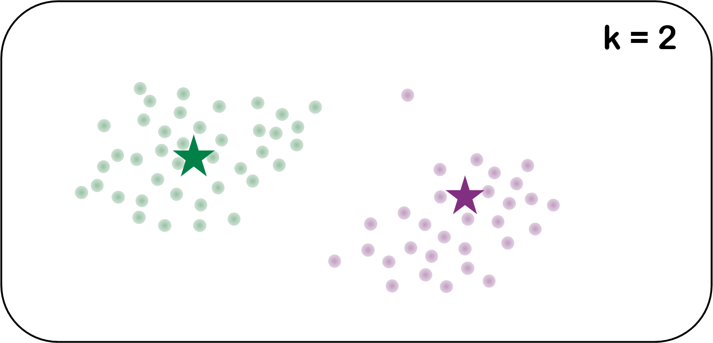

```{r setup, include=FALSE}
options(htmltools.dir.version = FALSE)
```

layout: false
class: split-70 hide-slide-number
background-image: url("bkgs/desktopbw.jpg")
background-size: cover

.column.slide-in-left[
.sliderbox.vmiddle.shade_Icepackblue.left[
  .font5[Gemma Dawson]
    <br>
]]

.column[.content.vmiddle.right[
### .Icepackblue[`r anicon::faa("laptop", animate="float")`  www.icepack.ai]
### .Icepackblue[`r anicon::faa("github", animate="float")`  @GemmaDawson]
### .Icepackblue[`r anicon::faa("twitter", animate="float")`  @gemmadawsonza]
]]

---

class: split-70 hide-slide-number
background-image: url("images/Nobel5.jpg")
background-size: cover

.column.slide-in-left[
.sliderbox.vmiddle.shade_main.left[
.font5[Nobel Prize Analysis]]]
.column[
]

---

layout: false
class: middle center .bg-white
# .ORSSAred[All Nobel Laureates]


???
Established in 1895 by Alfred Nobel, the inventor of dynamite, the prizes were first awarded in 1901 for Chemistry, Literature, Peace, Physics and Physiology or Medicine.  The prize for Economic Sciences was established in 1968 with the first prize being awarded the following year.

As of yesterday, the Nobel Prizes have been awarded 590 times to **904** Laureates and 31 organisations.  
Four people have been honoured twice while two organisations have received multiple awards.  

---

layout: false
class: middle center .bg-white
# .ORSSAred[Nobel Prizes Awarded to People]


???
Removing the colour from the dots representing organisations from the picture, 327 people have been the sole reciepent of the award and the remaining 577 have shared the award.  The average age of a Nobel winner is 60 years old with the youngest being 17 and the oldest 90.

---

layout: false
class: middle center .bg-white
# .ORSSAred[Nobel Prizes Awarded to Women]


???
Now removing the colour from the dots representing male winners, we can see that only 50 women have received a Nobel Prize over its history.  This represents 5% of the total winners.

Marie Curie was the first, winning the Physics prize in 1903 which she shared with her husband for their work in radiation.  In 1911, she was earned a second, and this time unshared Nobel Prize for Chemistry.  Thus making her one of only two people to have been awarded prizws two different categories.  Her daughter, Irene, went on win the 1935 Nobel Prize in Chemistry.

---

layout: false
class: middle center .bg-white
# .ORSSAred[Nobel Prizes Awarded to People Born in Africa]


???
The first prize awarded to an African was given to Max Theiler for his work in developing a yellow fever vaccination.  The first black African to receieve the award was Albert Luthuli in 1960.  The first black African woman, Wangari Maathai from Kenya received her award for peace in 2004.  And the lastest receiptient is the first from the Congo, Denis Mukwege was awarded the Nobel Peace Prize just last week.  You may also notice that an African has never received the economics award.

---

layout: false
class: middle center .bg-white
# .ORSSAred[STEM Nobel Prizes Awarded to People]


???

Let's focus on the three STEM categories, chemistry

---

layout: false
class: middle center .bg-white
# .ORSSAred[STEM Nobel Prizes Awarded to Women]


???
Only three women have been awarded individual awards, Marie Curie, Dorothy Hodgkin (chemistry), and Barbara McClintock (physiology or medicine).  
This year, Donna Strickland became the third women to be awarded the Physics Nobe Prize.

---

layout: false
class: middle center .bg-white
# .ORSSAred[STEM Nobel Prizes Awarded to People Born in Africa]


???

---

layout: false
class: middle center bg-main1


.font3[a design project that highlights badass women in science, technology, engineering & mathematics]

---

layout: true
class: split-two 

.column.bg-white[.content.vmiddle.center[
 {{content}}
 
]]

.column.bg-main5[.split-five[
  .row.bg-main5[.content.vmiddle.center[
# .RLadiesPurple[Dame Susan Jocelyn Bell Burnell]
  ]]
  .row.bg-main5[.content.vmiddle.center[
# .RLadiesPurple[Dr. Rosalind Franklin]
  ]]
  .row.bg-main5[.content.vmiddle.center[
# .RLadiesPurple[Dr. Esther Lederberg]
  ]]
  .row.bg-main5[.content.vmiddle.center[
# .RLadiesPurple[Dr. Lise Meitner]
  ]]
  .row.bg-main5[.content.vmiddle.center[
# .RLadiesPurple[Dr. Chien-Shiung Wu]
  ]]
]]


---

class: hide-row2-col2 hide-row3-col2 hide-row4-col2 hide-row5-col2


???
1943 - present


Dame Susan Jocelyn Bell Burnell, at 24, as a post-graduate student at the University of Cambridge, discovered the first four pulsars. In July 1967, she detected some noise on her chart-recorder papers that tracked across the sky with stars. She found that the signal was pulsing with great regularity and at a rate of a pulse per second. It was temporarily dubbed Little Green Man-1 (LGM-1). She found 3 more pulsars to confirm her suspicions. Despite having been the first to observe and precisely analyze pulsars, her advisor Antony Hewish and astronomer Martin Ryle won the Nobel Prize for the discovery. In 2014, she was made president of the Royal Society of Edinburgh, the first woman to hold that office. She is also the only woman to ever win the Herschel Medal, awarded by the Royal Astronomical Society, for “investigations of outstanding merit in observational astrophysics”.

** “The limiting factor is culture, not women’s brains, and I regret that its still necessary to say that.”**

---

class: fade-row1-col2 hide-row3-col2 hide-row4-col2 hide-row5-col2


???
1920 - 1958

Rosalind Franklin is the dame of DNA. Born in 1920, she used X-ray diffraction to take a picture of DNA that changed biology. Photo 51, her picture of DNA, was shown to James Watson and Francis Crick without her knowledge by her colleague Maurice Wilkins who thought she was just a lab assistant when she was heading up her own projects. This photo allowed Watson and Crick to deduce the correct structure for DNA. They published a series of articles in the scientific journal Nature in April 1953. Franklin also published in the same issue and provided even more details on DNA's structure. Though Franklin's image of DNA was critical to deciphering its structure, she passed away before 1962 when the Nobel Prize in Physiology or Medicine was awarded to Watson, Crick and Wilkins. Her story is certainly one of the most well-known and shameful instances of a researcher being robbed of credit.


---

class: fade-row1-col2 fade-row2-col2 hide-row4-col2 hide-row5-col2


???
1922 - 2006

Esther Lederberg was an American microbiologist and pioneer of bacterial genetics. Her notable contributions include the discovery of the lambda phage, the transfer of genes between bacteria by specialized transduction, the development of replica plating, and the discovery of the bacterial fertility factor F (F plasmid). These contributions laid the foundation for much of the genetics work done in the latter half of the twentieth century. Lederberg also founded and directed the Plasmid Reference Center at Stanford University, where she maintained, named, and distributed plasmids of many types.  Her on antibiotic resistance helped her first husband, the molecular biologist Joshua Lederberg, win the Nobel prize and while he privately admitted she was deserving of the award he failed to mention he contributions during his acceptance speech for the award.

---

class: fade-row1-col2 fade-row2-col2 fade-row3-col2  hide-row5-col2


???
1878 - 1968

Lise Meitner was born in Vienna, Austria, in 1878 and studied physics at the University of Vienna. Her groundbreaking work started with the discovery of the element protactinium with Otto Hahn. Then, in 1923, Meitner deduced the Auger effect, when an atom sheds one or two of its electrons in order to stabilize. However, the process is named for French physicist Pierre Auger, who didn't even identify the atomic reaction for another two years. This was the first of her breakthroughs that would be blatantly overlooked. 

In 1939, Meitner along with her nephew, Otto Frisch, discovered nuclear fission, or the practice of splitting atoms apart with neutrons. This research was instrumental in the development of the atomic bomb. Meitner first discovered nuclear fission, but Otto Hahn took home the Nobel Prize in Chemistry for the discovery in 1944. She never won the Nobel Prize for her work, but element 109 of the periodic table was named Meitnerium (Mt) in her honor in 1992.

---

class: fade-row1-col2 fade-row2-col2 fade-row3-col2 fade-row4-col2


???
1912 - 1997

Chien-Shiung Wu was one of the most esteemed scientists of the 20th century but few have heard of her. She overcame numerous uphill battles to achieve many firsts in her lifetime. Wu was born in 1912 in Liuho, China. After graduating from college in China, she embarked on a long steamship voyage to San Francisco where she joined Ernest O. Lawrence's lab at the University of California, Berkeley. There, as a grad student, she became known for her incredible work ethic, a reputation that would follow her for the rest of her career.

After receiving her Ph.D. at Berkeley she moved to the east coast and became the first female instructor in the Physics Department at Princeton. She moved to Columbia University to join the top-secret Manhattan Project and was instrumental in helping develop the process for separating uranium metal into the U-235 and U-238 isotopes by gaseous diffusion for the development of the atomic bomb.

She remained at Columbia after the war, and it was there that she devised and successfully ran series of experiments that shattered a bedrock law of physics, disproving the "Law of Conservation of Parity". Unfortunately, she did not win the Nobel Prize for this discovery. Her colleagues Tsung Dao Lee and Chen Ning Yang won the Prize in 1957.

Despite the Nobel snub, Wu achieved many firsts in her lifetime. She was the first Chinese-American to be elected into the U.S. National Academy of Sciences. The first woman with an honorary doctorate from Princeton University, the first female President of the American Physical Society, elected in 1975, the first person selected to receive the Wolf Prize in Physics in its inaugural year of 1978, One of the first Chinese-American educators to travel to Red China for visits in the 1970s, and the first living scientist to have an asteroid (2752 Wu Chien-Shiung) named after her.


---

layout: false
class: split-70 hide-slide-number
background-image: url("bkgs/bg1.jpg")
background-size: cover

.column.slide-in-left[
.sliderbox.vmiddle.shade_main.right[
.font5[Machine Learning]]]
.column[
]

???
Bell Burnell had to fight to be allowed to attend science classes in secondary school while the other girls were learning to cook.  
Franklin presented a seminar which Jim Watson was in attendance.  His only note about her dress sense instead of the work that could have provided the vital numerical evidence 15 months earlier than when he and Crick made their breakthrough.
Esther Ledergberg joined the faculty at Standford University in 1959 having already made a significant contriubtions to her field but it would 25 years before she would attain the title professor.
Meitner had to request special given access to the laboratory as head of department was concerned that women would set their hair on fire and even then she was not permitted to use the front door.
We laugh at these absurd policies and ideas and speak amonst ourselves how good it is that society has evolved but in the last week a senior Italian researcher gave a talk at a CERN workshop where he declared that Physics was built by men and claimed that it was men who being discriminated against.


These five remarkable women fought against a society that time and time again told them that they were not needed and not welcome but they pushed back and accomplished great things.


---

layout: true
class: split-20

.row.bg-main1[.content.vmiddle.center[
.font4[What is Machine Learning?]
]]

.row[.content[
  .split-60[
  .column[.content.vmiddle.center[
 {{ content }}
]]
  .column[.content.vmiddle.right[
  .padding[.img-fill[]]
  ]]
  ]]]
  

???
 .font4[“The field of study that gives computers the ability to learn **without being explicitly programmed**.”]
---

class: hide-row2-col1 hide-row2-col2

---

class: hide-row2-col2
count: false

<h1 style="color:#562457";>The field of study that gives computers the ability to learn without being explicitly programmed.</h1>

---

class: hide-row2-col2
count: false

<h1 style="color:#562457";>The field of study that gives computers the ability to learn <strong>without being explicitly programmed</strong>.</h1>


---

count: false

<h1  style="color:#562457";>The field of study that gives computers the ability to learn <strong>without being explicitly programmed</strong>.</h1>

---

layout: true
class: split-20

.row.bg-main1[.content.vmiddle.center[
.font4[What is Machine Learning?]
]]

.row[.content[
  .split-two[
  .column[.content.vtop.center[
  .font3[.RLadiesPurple[Supervised Learning]]
  .padding[
  .img-fill[]
  ]]]
  .column[.content.vtop.center[
  .font3[.RLadiesPurple[Unsupervised Learning]]
  .padding[
  .img-fill[]
  ]]
  ]]
  ]]
  
---

class: hide-row2-col1 hide-row2-col2

---

class: hide-row2-col2
count: false

---

count: false

---

layout: false
class: split-20

.row.bg-main1[.content.vmiddle.center[
.font4[What is Supervised Learning?]
]]

.row[.content.vmiddle.center[
# .RLadiesPurple[**GOAL**: create a predictive model]

]]

???
supervised learning is done using a ground truth.

goal of supervised learning is to learn a function that, given a sample of data and desired outputs, best approximates the relationship between input and output observable in the data

if the output label is a real number, we call the task regression. If the label is from the limited number of values, where these values are unordered, then it’s classification.

---

layout: true
class: split-20

.row.bg-main1[.content.vmiddle.center[
.font4[What is Supervised Learning?]
]]

.row[.content[.split-two[
  .column[.content.vtop.center[
  .RLadiesPurple[.font2[Regression]]<br>
  <br>
  
  ]]
  .column[.content.vtop.center[
  .RLadiesPurple[.font2[Classification]]<br>
  <br>
  
  ]]
  ]]]


???
# classification
- k-nearest neighbours
- trees

#regression
- linear regression
- decison trees & random forest

---

class: hide-row2-col1 hide-row2-col2

---

class: hide-row2-col2
count: false

---

count: false

---

layout: false
class: split-20

.row.bg-main1[.content.vmiddle.center[
.font4[What is Unsupervised Learning?]
]]

.row[.content.vmiddle.center[
# .RLadiesPurple[**GOAL**: create a descriptive model]

]]

???
does not have labeled outputs, 

goal is to infer the natural structure present within a set of data points

---

layout: false
class: split-20

.row.bg-main1[.content.vmiddle.center[
.font4[What is Unsupervised Learning?]
]]

.row[.content.vtop.center[
  .RLadiesPurple[.font2[Clustering]]<br>
  <br>
  
  ]]
  
---

class: split-70 hide-slide-number
background-image: url("bkgs/blocks.jpg")
background-size: cover

.column.slide-in-left[
.sliderbox.vmiddle.shade_main.left[
.font5[Programming Basics]<br>
.font3[R Language]]]
.column[
]

---

layout: false
class: split-20

.row.bg-main1[.content.vmiddle.center[
.font4[Arthimetic]
]]

.row.bg-black[.content.left[
```{r}
    1 + 3
```
  ]]


???

---

layout: false
class: split-20
count: false

.row.bg-main1[.content.vmiddle.center[
.font4[Arthimetic]
]]

.row.bg-black[.content.left[
```{r}
    1 + 3
    1:5
```
  ]]


???

---

layout: false
class: split-20
count: false

.row.bg-main1[.content.vmiddle.center[
.font4[Arthimetic]
]]

.row.bg-black[.content.left[
```{r}
    1 + 3
    1:5
    1:5*2
```
  ]]


???

---

layout: false
class: split-20

.row.bg-main1[.content.vmiddle.center[
.font4[Assignment]
]]

.row.bg-black[.content.left[
```{r}
    x <- 10 - 8
```
  ]]


???

---

layout: false
class: split-20
count: false

.row.bg-main1[.content.vmiddle.center[
.font4[Assignment]
]]

.row.bg-black[.content.left[
```{r}
    x <- 10 - 8

    x
```
  ]]


???

---

layout: false
class: split-20
count: false

.row.bg-main1[.content.vmiddle.center[
.font4[Assignment]
]]

.row.bg-black[.content.left[
```{r}
    x <- 10 - 8

    x
    
    y <- 1:15
```
  ]]


???

---

layout: false
class: split-20
count: false

.row.bg-main1[.content.vmiddle.center[
.font4[Assignment]
]]

.row.bg-black[.content.left[
```{r}
    x <- 10 - 8

    x
    
    y <- 1:15
    
    y
```
  ]]


???

---

layout: false
class: split-20
count: false

.row.bg-main1[.content.vmiddle.center[
.font4[Assignment]
]]

.row.bg-black[.content.left[
```{r}
    x <- 10 - 8

    x
    
    y <- 1:15
    
    y
    
    ls()
```
  ]]


???

---

layout: false
class: split-20

.row.bg-main1[.content.vmiddle.center[
.font4[Assignment]
]]

.row.bg-black[.content.left[
```{r}
    y
```
  ]]


???

---

layout: false
class: split-20
count: false

.row.bg-main1[.content.vmiddle.center[
.font4[Assignment]
]]

.row.bg-black[.content.left[
```{r}
    y

    z <-  y ^ x
```
  ]]


???

---

layout: false
class: split-20
count: false

.row.bg-main1[.content.vmiddle.center[
.font4[Assignment]
]]

.row.bg-black[.content.left[
```{r}
    y

    z <-  y ^ x
    
    z
```
  ]]


???

---

layout: false
class: split-20
count: false

.row.bg-main1[.content.vmiddle.center[
.font4[Assignment]
]]

.row.bg-black[.content.left[
```{r}
    y

    z <-  y ^ x
    
    z
    
    y <- y ^ x
```
  ]]


???

---

layout: false
class: split-20
count: false

.row.bg-main1[.content.vmiddle.center[
.font4[Assignment]
]]

.row.bg-black[.content.left[
```{r echo= FALSE}
y <- 1:15
```
```{r}
    y

    z <-  y ^ x
    
    z
    
    y <- y ^ x
    
    y
```
  ]]


???

---

layout: false
class: split-20

.row.bg-main1[.content.vmiddle.center[
.font4[Functions]
]]

.row.bg-black[.content.left[
```{r}
    Sys.time()
```
]]


???

---

layout: false
class: split-20
conut: false

.row.bg-main1[.content.vmiddle.center[
.font4[Functions]
]]

.row.bg-black[.content.left[
```{r}
    Sys.time()

    seq(from = 1, to = 15, by = 3)
```
]]


???

---

layout: false
class: split-20
conut: false

.row.bg-main1[.content.vmiddle.center[
.font4[Functions]
]]

.row.bg-black[.content.left[
```{r}
    Sys.time()

    seq(from = 1, to = 15, by = 3)
    
    my_sequence <- seq(from = 1, to = 15, by = 3)

```
]]


???

---

layout: false
class: split-20
conut: false

.row.bg-main1[.content.vmiddle.center[
.font4[Functions]
]]

.row.bg-black[.content.left[
```{r}
    Sys.time()

    seq(from = 1, to = 15, by = 3)
    
    my_sequence <- seq(from = 1, to = 15, by = 3)

    median(my_sequence)
```
]]


???

---

layout: false
class: split-20

.row.bg-main1[.content.vmiddle.center[
.font4[Functions]
]]

.row.bg-black[.content[
```{r}
    my_text <- tolower("WHY ARE YOU SHOUTING?")
```
]]


???

---

layout: false
class: split-20
count: false

.row.bg-main1[.content.vmiddle.center[
.font4[Functions]
]]

.row.bg-black[.content[
```{r}
    my_text <- tolower("WHY ARE YOU SHOUTING?")

    my_text
```
]]


???

---

layout: false
class: split-20
count: false

.row.bg-main1[.content.vmiddle.center[
.font4[Functions]
]]

.row.bg-black[.content[
```{r}
    my_text <- tolower("WHY ARE YOU SHOUTING?")

    my_text
    
    text_vector <- c("one", "two", "three", "Four", "fiVE")
```
]]


???

---

layout: false
class: split-20
count: false

.row.bg-main1[.content.vmiddle.center[
.font4[Functions]
]]

.row.bg-black[.content[
```{r}
    my_text <- tolower("WHY ARE YOU SHOUTING?")

    my_text
    
    text_vector <- c("one", "TWO", "thrEe", "Four", "fiVE")
    
    grepl(x = text_vector, pattern = "two")
```
]]


???

---

layout: false
class: split-20
count: false

.row.bg-main1[.content.vmiddle.center[
.font4[Functions]
]]

.row.bg-black[.content[
```{r}
    my_text <- tolower("WHY ARE YOU SHOUTING?")

    my_text
    
    text_vector <- c("one", "TWO", "thrEe", "Four", "fiVE")
    
    grepl(x = text_vector, pattern = "two")
    
    grepl(x = tolower(text_vector), pattern = "two")
```
]]


???

---

layout: true
class: split-20

.row.bg-main1[.content.vmiddle.center[
.font4[Packages]
]]

.row[.content[.split-three[
.column[.content.vmiddle.center[

]]
.column[.content.vmiddle.center[

]]
.column[.content.vmiddle.center[

]]
]]]

---

class: hide-row2-col1 hide-row2-col2 hide-row2-col3

---

class: hide-row2-col2 hide-row2-col3
count: false

---

class: hide-row2-col3
count: false

---

class: 
count: false


---

layout: false
class: split-20

.row.bg-main1[.content.vmiddle.center[
.font4[Vectors, Matrices, & Data Frames]
]]

.row.bg-black[.content.left[
]]

---

layout: false
class: split-20

.row.bg-main1[.content.vmiddle.center[
.font4[**Vectors**, Matrices, & Data Frames]
]]

.row.bg-black[.content.left[
```{r}
    y
    
```
]]


???

---

layout: false
class: split-20
count: false

.row.bg-main1[.content.vmiddle.center[
.font4[**Vectors**, Matrices, & Data Frames]
]]

.row.bg-black[.content.left[
```{r}
    y

    text_vector
```
]]


???


---

layout: false
class: split-20

.row.bg-main1[.content.vmiddle.center[
.font4[Vectors, **Matrices**, & Data Frames]
]]

.row.bg-black[.content.left[
```{r}
    a <- matrix(1:6, ncol = 3, nrow = 2)

    a
```
]]


???

---

layout: false
class: split-20

.row.bg-main1[.content.vmiddle.center[
.font4[Vectors, **Matrices**, & Data Frames]
]]

.row.bg-black[.content.left[
```{r}
    a <- matrix(1:6, ncol = 3, nrow = 2)

    a
    
    a[1,3]
```
]]


???

---

layout: false
class: split-20
count: false

.row.bg-main1[.content.vmiddle.center[
.font4[Vectors, **Matrices**, & Data Frames]
]]

.row.bg-black[.content.left[
```{r}
    a <- matrix(1:6, ncol = 3, nrow = 2)

    a
    
    a[1,3]
    
    a[,2]
```
]]


???

---

layout: false
class: split-20

.row.bg-main1[.content.vmiddle.center[
.font4[Vectors, Matrices, & **Data Frames**]
]]

.row.bg-black[.content.left[
```{r}
    my_first_df <- data.frame(x = 6:10, text_vector, stringsAsFactors = F)

    str(my_first_df)
```
]]


???
structure

---

layout: false
class: split-20
count: false

.row.bg-main1[.content.vmiddle.center[
.font4[Vectors, Matrices, & **Data Frames**]
]]

.row.bg-black[.content.left[
```{r}
    my_first_df <- data.frame(x = 6:10, text_vector, stringsAsFactors = F)

    str(my_first_df)
    
    my_first_df
```
]]


???

---

layout: false
class: split-20

.row.bg-main1[.content.vmiddle.center[
.font4[Vectors, Matrices, & **Data Frames**]
]]

.row.bg-black[.content.left[
```{r}
    my_first_df$x
```
]]


???

---

layout: false
class: split-20
count: false

.row.bg-main1[.content.vmiddle.center[
.font4[Vectors, Matrices, & **Data Frames**]
]]

.row.bg-black[.content.left[
```{r}
    my_first_df$x

    my_first_df$x/2
```
]]


???

---

layout: false
class: split-20
count: false

.row.bg-main1[.content.vmiddle.center[
.font4[Vectors, Matrices, & **Data Frames**]
]]

.row.bg-black[.content.left[
```{r}
    my_first_df$x

    my_first_df$x/2
    
    my_first_df$col3 <- my_first_df$x/2
```
]]


???

---

layout: false
class: split-20
count: false

.row.bg-main1[.content.vmiddle.center[
.font4[Vectors, Matrices, & **Data Frames**]
]]

.row.bg-black[.content.left[
```{r}
    my_first_df$x

    my_first_df$x/2
    
    my_first_df$col3 <- my_first_df$x/2
    my_first_df[1:2,]
```
]]


???

---

layout: false
class: split-20

.row.bg-main1[.content.vmiddle.center[
.font4[Pipe]
]]

.row[.content[

]]


???

---

layout: false
class: split-20
count: false

.row.bg-main1[.content.vmiddle.center[
.font4[Pipe]
]]

.row[.content.vmiddle.center[

]]

???


---

layout: false
class: split-20

.row.bg-main1[.content.vmiddle.center[
.font4[Pipe]
]]

.row.bg-black[.content.left[
```{r message=FALSE}
    library(dplyr)
```
]]

???

---

layout: false
class: split-20
count: false

.row.bg-main1[.content.vmiddle.center[
.font4[Pipe]
]]

.row.bg-black[.content.left[
```{r message=FALSE}
    library(dplyr)
```
```{r}
    my_first_df
```
]]

???

---

layout: false
class: split-20
count: false

.row.bg-main1[.content.vmiddle.center[
.font4[Pipe]
]]

.row.bg-black[.content.left[
```{r message=FALSE}
    library(dplyr)
```
```{r}
    my_first_df %>% 
          mutate(NewCol = paste(x, "-", text_vector, sep=" ")) 
```
]]

???

---

layout: false
class: split-20
count: false

.row.bg-main1[.content.vmiddle.center[
.font4[Pipe]
]]

.row.bg-black[.content.left[
```{r message=FALSE}
    library(dplyr)
```
```{r}
    my_first_df %>% 
          mutate(NewCol = paste(x, "-", text_vector, sep=" ")) %>% 
          filter(x > 7.25) 
```
]]

???

---

layout: false
class: split-20
count: false

.row.bg-main1[.content.vmiddle.center[
.font4[Pipe]
]]

.row.bg-black[.content.left[
```{r message=FALSE}
    library(dplyr)
```
```{r}
    my_first_df %>% 
          mutate(NewCol = paste(x, "-", text_vector, sep=" ")) %>% 
          filter(x > 7.25) %>% 
          select(z = col3, NewCol)
```
]]

???

---

class: split-70 hide-slide-number
background-image: url("bkgs/tree.jpg")
background-size: cover

.column.slide-in-left[
.sliderbox.vmiddle.shade_main.left[
.font5[Supervised Learning]<br>
.font3[Decision Trees]]]
.column[
]

???
# Pros
- simple to understand and interpret
- Works with both numerical and categorical data

# Cons
- Easy to overfit the tree

# A decision tree uses if-then statements to define patterns in data.
If the price of a house is above some value, then the house is probably in some Cape Town.
These statements are called forks and split the data into two **branches**

The initial split might will likely classify some homes into the wrong category and we call these **false negatives** and **false postives**

The next step in the process is to look at the subset of the data looking at a different variable, maybe the size of the house provides the next split for houses the model is placing in Johannesburg while the year built provides a better split for houses that model predicts are in Cape Town.  This repetition is called **recursion**.  Deciding on which variable provides the best split is determined using a mathematical model, typically we look at the minimising the error.

We grow the tree until we meet a predefined stopping point.

Then we test the tree using data that was not provided to train the model.  

---

layout: false
class: split-20

.row.bg-main1[.content.vmiddle.center[
.font4[Supervised Learning: Decision Trees]
]]

.row[.content.vmiddle.center[
  
  ]]

---

layout: false
class: split-20
count: false

.row.bg-main1[.content.vmiddle.center[
.font4[Supervised Learning: Decision Trees]
]]

.row[.content.vmiddle.center[
  
  ]]
  
---

layout: false
class: split-20
count: false

.row.bg-main1[.content.vmiddle.center[
.font4[Supervised Learning: Decision Trees]
]]

.row[.content.vmiddle.center[
  
  ]]
  
---

layout: false
class: split-20
count: false

.row.bg-main1[.content.vmiddle.center[
.font4[Supervised Learning: Decision Trees]
]]

.row[.content.vmiddle.center[
  
  ]]
  
---

layout: false
class: split-20
count: false

.row.bg-main1[.content.vmiddle.center[
.font4[Supervised Learning: Decision Trees]
]]

.row[.content.vmiddle.center[
  
  ]]

---

layout: false
class: split-20
count: false

.row.bg-main1[.content.vmiddle.center[
.font4[Supervised Learning: Decision Trees]
]]

.row[.content.vmiddle.center[
  
  ]]
  
---

layout: false
class: split-20
count: false

.row.bg-main1[.content.vmiddle.center[
.font4[Supervised Learning: Decision Trees]
]]

.row[.content.vmiddle.center[
  
  ]]

---

layout: false
class: split-20
count: false

.row.bg-main1[.content.vmiddle.center[
.font4[Supervised Learning: Decision Trees]
]]

.row[.content.vmiddle.center[
  
  ]]
  
---

layout: false
class: split-20
count: false

.row.bg-main1[.content.vmiddle.center[
.font4[Supervised Learning: Decision Trees]
]]

.row[.content.vmiddle.center[
  
  ]]

---

layout: false
class: split-20
count: false

.row.bg-main1[.content.vmiddle.center[
.font4[Supervised Learning: Decision Trees]
]]

.row[.content.vmiddle.center[
  
  ]]
  
---

layout: false
class: split-20
count: false

.row.bg-main1[.content.vmiddle.center[
.font4[Supervised Learning: Decision Trees]
]]

.row[.content.vmiddle.center[
  
  ]]

---

layout: false
class: split-20
count: false

.row.bg-main1[.content.vmiddle.center[
.font4[Supervised Learning: Decision Trees]
]]

.row[.content.vmiddle.center[
  
  ]]


---

layout: false
class: split-70 hide-slide-number
background-image: url("bkgs/titanic.jpg")
background-size: cover

.column.slide-in-left[
.sliderbox.vmiddle.shade_main.left[
.font5[Titanic]<br>
.font3[Machine Learning from Disaster]]]
.column[
]

---

layout: true
class: split-20

.row.bg-main1[.content.vmiddle.center[
.font4[Machine Learning from Disaster]
]]

.row[.split-two[
  .column[.content.center[
  [](https://www.kaggle.com/c/titanic)
  # .RLadiesPurple[training.csv]
  .RLadiesPurple[.font2[891 entries & 11 variables]]
<br>
  # .RLadiesPurple[test.csv]
  .RLadiesPurple[.font2[418 entries & 10 variables]]
  ]]
  .column[.content.vmiddle.center[
  # .RLadiesPurple[**GOAL**] <br>
  ### .RLadiesPurple[predict which of the Titanic's passengers survived]
  
  ]]
]]

???
https://www.kaggle.com/c/titanic

April 15 1912

---

class: hide-row2-col1 hide-row2-col2

---

class: hide-row2-col2
count: false

---

count: false

---

layout: true
class: split-30 with-border

.column[.split-two[
  .row.bg-main1[.content.vmiddle.left[
    # Load libraries
  ]]
  .row.bg-main1[.content.vmiddle.left[
    # Import the data
  ]]
]]

.column[.split-two[
  .row.bg-black[.content.vmiddle.left[
    ```{r message=FALSE}
    library(tidyverse)
    library(rpart)
    library(rpart.plot)
    ```
  ]]
  .row.bg-black[.content.vmiddle.left[
    ```{r message = FALSE}
    titanic <- read_csv(file = "data/titanic.csv", col_names = TRUE)
    ```
  ]]
]]

---

class: hide-row1-col2 hide-row2-col1 hide-row2-col2 

---

class: hide-row2-col1 hide-row2-col2
count: false

---

class: hide-row2-col2
count: false

---

count: false

---

layout: false
class: split-10 with-border
.row.bg-main1[.content.vmiddle.left[
  # Let's look at the data
]]
.row.bg-black[.content.vtop.left[
  ```{r}
  head(titanic)
  ```
]]

---

layout: false
class: split-10 with-border
.row.bg-main1[.content.vmiddle.left[
  # Tidy & Transform
]]
.row.bg-black[.content.vtop.left[
  ```{r}
  summary(titanic$Pclass)
  ```
]]

---

layout: false
class: split-10 with-border
count: false
.row.bg-main1[.content.vmiddle.left[
  # Tidy & Transform
]]
.row.bg-black[.content.vtop.left[
  ```{r}
  summary(titanic$Pclass)
  titanic$Pclass <- as.factor(titanic$Pclass)
  
  summary(titanic$Pclass)
  ```
]]


---

layout: false
class: split-10 with-border
.row.bg-main1[.content.vmiddle.left[
  # Tidy & Transform
]]
.row.bg-black[.content.vtop.left[
  ```{r}
  summary(titanic$Survived)
  ```
]]

---

layout: false
class: split-10 with-border
count: false

.row.bg-main1[.content.vmiddle.left[
  # Tidy & Transform
]]
.row.bg-black[.content.vtop.left[
  ```{r}
  summary(titanic$Survived)
  titanic$Survived <- if_else(condition = titanic$Survived == 1, 
                                true = "yes",
                                false = "no")
  
  summary(titanic$Survived)
  ```
]]

---

layout: false
class: split-10 with-border
.row.bg-main1[.content.vmiddle.left[
  # Tidy & Transform
]]
.row.bg-black[.content.vtop.left[
  ```{r}
  summary(titanic$Age)
  ```
]]

---

layout: false
class: split-10 with-border
count: false

.row.bg-main1[.content.vmiddle.left[
  # Tidy & Transform
]]
.row.bg-black[.content.vtop.left[
  ```{r}
  summary(titanic$Age)
  titanic$Age <- if_else(condition = is.na(titanic$Age), 
                          true = mean(titanic$Age, na.rm = T), 
                          false = titanic$Age)
  
  summary(titanic$Age)
  ```
]]

---

layout: false
class: split-10 with-border
.row.bg-main1[.content.vmiddle.left[
  # Tidy & Transform
]]
.row.bg-black[.content.vtop.left[
  ```{r}
  titanic$Family <- titanic$SibSp + titanic$Parch
  
  summary(titanic$Family)
  ```
]]

---

layout: false
class: split-10 with-border
.row.bg-main1[.content.vmiddle.left[
  # Tidy & Transform
]]
.row.bg-black[.content.vtop.left[
  ```{r}
  titanic <- titanic %>% 
                select(Pclass, Sex, Age, Fare, Family, Survived)

  glimpse(titanic)
  ```
]]

---

layout: false
class: split-10 with-border
.row.bg-main1[.content.vmiddle.left[
  # Model
]]
.row.bg-black[.content.vtop.left[
  ```{r fig.show("hold")}
  tree.titanic <- rpart(formula = Survived ~ ., data = titanic)
  
  rpart.plot(tree.titanic, fallen.leaves = F)
  ```
]]

---

layout: false
class: split-10 with-border

.row.bg-main1[.content.vmiddle.left[
 # Visualise & Communicate
]]

.row[.content.vmiddle.center[

]]

---

layout: false
class: split-10 with-border

.row.bg-main1[.content.vmiddle.left[
 # Predict
]]

.row[.content.vmiddle.center[

]]

---

layout: false
class: split-10 with-border
count: false

.row.bg-main1[.content.vmiddle.left[
 # Predict
]]

.row[.content.vmiddle.center[

]]

---

layout: false
class: split-10 with-border
count: false

.row.bg-main1[.content.vmiddle.left[
 # Predict
]]

.row[.content.vmiddle.center[

]]

---

layout: false
class: split-10 with-border

.row.bg-main1[.content.vmiddle.left[
 # Predict
]]

.row[.content.vmiddle.center[

]]

---

layout: false
class: split-10 with-border
count: false

.row.bg-main1[.content.vmiddle.left[
 # Predict
]]

.row[.content.vmiddle.center[

]]

---

layout: false
class: split-10 with-border
count: false

.row.bg-main1[.content.vmiddle.left[
 # Predict
]]

.row[.content.vmiddle.center[

]]

---

layout: false
class: split-10 with-border
count: false

.row.bg-main1[.content.vmiddle.left[
 # Predict
]]

.row[.content.vmiddle.center[

]]

---

layout: false
class: split-10 with-border
count: false

.row.bg-main1[.content.vmiddle.left[
 # But we all know that Jack could have survived`r anicon::faa("angry", animate="burst", colour="red")`
]]

.row[.content.vmiddle.center[

]]

---

layout: false
class: split-10 with-border
.row.bg-main1[.content.vmiddle.left[
  # Import, Tidy, & Transform the Test Data
]]
.row.bg-black[.content.vtop.left[
  ```{r message = FALSE}
  # Import the test.csv file
  titanic.test <- read_csv(file = "data/test.csv", col_names = TRUE)
  ```
]]

---

layout: false
class: split-10 with-border
count: false

.row.bg-main1[.content.vmiddle.left[
  # Import, Tidy, & Transform the Test Data
]]
.row.bg-black[.content.vtop.left[
  ```{r message = FALSE}
  # Import the test.csv file
  titanic.test <- read_csv(file = "data/test.csv", col_names = TRUE)
  
  # Convert the Passenger Class to a factor
  titanic.test$Pclass <- as.factor(titanic.test$Pclass)
  ```
]]

---

layout: false
class: split-10 with-border
count: false

.row.bg-main1[.content.vmiddle.left[
  # Import, Tidy, & Transform the Test Data
]]
.row.bg-black[.content.vtop.left[
  ```{r message = FALSE}
  # Import the test.csv file
  titanic.test <- read_csv(file = "data/test.csv", col_names = TRUE)
  
  # Convert the Passenger Class to a factor
  titanic.test$Pclass <- as.factor(titanic.test$Pclass)
  
  # Tidy the missing Age observations
  titanic.test$Age <- if_else(is.na(titanic.test$Age), 
                                mean(titanic$Age, na.rm = T),   
                                titanic.test$Age)
  ```
]]

---

layout: false
class: split-10 with-border
count: false

.row.bg-main1[.content.vmiddle.left[
  # Import, Tidy, & Transform the Test Data
]]
.row.bg-black[.content.vtop.left[
  ```{r message = FALSE}
  # Import the test.csv file
  titanic.test <- read_csv(file = "data/test.csv", col_names = TRUE)
  
  # Convert the Passenger Class to a factor
  titanic.test$Pclass <- as.factor(titanic.test$Pclass)
  
  # Tidy the missing Age observations
  titanic.test$Age <- if_else(is.na(titanic.test$Age), 
                                mean(titanic$Age, na.rm = T),   
                                titanic.test$Age)
  
  # Create the Family variable
  titanic.test$Family <- titanic.test$SibSp + titanic.test$Parch
  ```
]]

---

layout: false
class: split-10 with-border
count: false

.row.bg-main1[.content.vmiddle.left[
  # Import, Tidy, & Transform the Test Data
]]
.row.bg-black[.content.vtop.left[
  ```{r message = FALSE}
  # Import the test.csv file
  titanic.test <- read_csv(file = "data/test.csv", col_names = TRUE)
  
  # Convert the Passenger Class to a factor
  titanic.test$Pclass <- as.factor(titanic.test$Pclass)
  
  # Tidy the missing Age observations
  titanic.test$Age <- if_else(is.na(titanic.test$Age), 
                                mean(titanic$Age, na.rm = T),   
                                titanic.test$Age)
  
  # Create the Family variable
  titanic.test$Family <- titanic.test$SibSp + titanic.test$Parch
  
  # Grab the variables we originally used
  titanic.test <- titanic.test %>%
                    select(PassengerId, Pclass, Sex, Age, Fare, Family)
  ```
]]

---

layout: false
class: split-10 with-border
.row.bg-main1[.content.vmiddle.left[
  # Import, Tidy, & Transform the Test Data
]]
.row.bg-black[.content.vtop.left[
  ```{r}
  titanic.test$Predict <- predict(tree.titanic, titanic.test, type = "class")
  
  summary(titanic.test$Predict)
  ```
]]

---

layout: false
class: split-10 with-border
count: false

.row.bg-main1[.content.vmiddle.left[
  # Import, Tidy, & Transform the Test Data
]]
.row.bg-black[.content.vtop.left[
  ```{r}
  titanic.test$Predict <- predict(tree.titanic, titanic.test, type = "class")
  
  summary(titanic.test$Predict)
  
  titanic.test$Survived <- if_else(titanic.test$Predict == "yes", 1, 0)
  
  titanic.submit <- titanic.test %>% 
                      select(PassengerId, Survived)
  
  
  write.csv(titanic.submit, file = "data/titanic_answer.csv", row.names = FALSE)
  ```
]]

---

layout: false
class: split-10 with-border
count: false

.row.bg-main1[.content.vmiddle.left[
 # How did we do?
]]

.row[.content.center[
<br>

]]

---

class: split-70 hide-slide-number
background-image: url("bkgs/berryGrouping.jpg")
background-size: cover

.column.slide-in-left[
.sliderbox.vmiddle.shade_main.left[
.font5[Unsupervised Learning]<br>
.font3[k-Means Clustering]]]
.column[
]

???

---

layout: false
class: split-20

.row.bg-main1[.content.vmiddle.center[
.font4[Unsupervised Learning: k-Means Clustering]
]]

.row[.content.vmiddle.center[
  
  ]]
  
---

layout: false
class: split-20
count: false

.row.bg-main1[.content.vmiddle.center[
.font4[Unsupervised Learning: k-Means Clustering]
]]

.row[.content.vmiddle.center[
  
  ]]
  
---

layout: false
class: split-20
count: false

.row.bg-main1[.content.vmiddle.center[
.font4[Unsupervised Learning: k-Means Clustering]
]]

.row[.content.vmiddle.center[
  
  ]]

---

layout: false
class: split-20
count: false

.row.bg-main1[.content.vmiddle.center[
.font4[Unsupervised Learning: k-Means Clustering]
]]

.row[.content.vmiddle.center[
  
  ]]
  
---

layout: false
class: split-20
count: false

.row.bg-main1[.content.vmiddle.center[
.font4[Unsupervised Learning: k-Means Clustering]
]]

.row[.content.vmiddle.center[
  
  ]]

---

layout: false
class: split-20
count: false

.row.bg-main1[.content.vmiddle.center[
.font4[Unsupervised Learning: k-Means Clustering]
]]

.row[.content.vmiddle.center[
  
  ]]
  
---

layout: false
class: split-20
count: false

.row.bg-main1[.content.vmiddle.center[
.font4[Unsupervised Learning: k-Means Clustering]
]]

.row[.content.vmiddle.center[
  
  ]]
  
---

layout: false
class: split-20
count: false

.row.bg-main1[.content.vmiddle.center[
.font4[Unsupervised Learning: k-Means Clustering]
]]

.row[.content.vmiddle.center[
  
  ]]
  
---

layout: false
class: split-20
count: false

.row.bg-main1[.content.vmiddle.center[
.font4[Unsupervised Learning: k-Means Clustering]
]]

.row[.content.vmiddle.center[
  
  ]]

---

layout: false
class: split-20
count: false

.row.bg-main1[.content.vmiddle.center[
.font4[Unsupervised Learning: k-Means Clustering]
]]

.row[.content.vmiddle.center[
  
  ]]
  
---

layout: false
class: split-20
count: false

.row.bg-main1[.content.vmiddle.center[
.font4[Unsupervised Learning: k-Means Clustering]
]]

.row[.content.vmiddle.center[
  
  ]]

---

layout: false
class: split-20
count: false

.row.bg-main1[.content.vmiddle.center[
.font4[Unsupervised Learning: k-Means Clustering]
]]

.row[.content.vmiddle.center[
  
  ]]
  
---

layout: false
class: split-20
count: false

.row.bg-main1[.content.vmiddle.center[
.font4[Unsupervised Learning: k-Means Clustering]
]]

.row[.content.vmiddle.center[
  
  ]]
  
---

layout: false
class: split-20
count: false

.row.bg-main1[.content.vmiddle.center[
.font4[Unsupervised Learning: k-Means Clustering]
]]

.row[.content.vmiddle.center[
  
  ]]

---

layout: false
class: split-20
count: false

.row.bg-main1[.content.vmiddle.center[
.font4[Unsupervised Learning: k-Means Clustering]
]]

.row[.content.vmiddle.center[
  
  ]]
  
---

layout: false
class: split-20
count: false

.row.bg-main1[.content.vmiddle.center[
.font4[Unsupervised Learning: k-Means Clustering]
]]

.row[.content.vmiddle.center[
  
  ]]

---

layout: false
class: split-70 hide-slide-number
background-image: url("bkgs/nycTaxi2.jpg")
background-size: cover

.column.slide-in-left[
.sliderbox.vmiddle.shade_main.left[
.font5[NYC Taxi]<br>
.font3[Machine Learning from Disaster]]]
.column[
]
  
---

layout: true
class: split-20

.row.bg-main1[.content.vmiddle.center[
.font4[NYC Taxi]
]]

.row[.split-two[
  .column[.content.center[
  [](https://www.kaggle.com/c/titanic)
  # .RLadiesPurple[taxi.csv]
  .RLadiesPurple[.font2[9150 entries & 10 variables]]
  ]]
  .column[.content.vmiddle.center[
  # .RLadiesPurple[**GOAL**] <br>
  ### .RLadiesPurple[find locations for **five** Manhattan taxi stands]
  
  ]]
]]

???
pickup date & time
pick up long
pick up lat
dropoff long
dropoff lat
passenger count

---

class: hide-row2-col1 hide-row2-col2

---

class: hide-row2-col2
count: false

---

count: false

---

layout: true
class: split-30 with-border

.column[.split-two[
  .row.bg-main1[.content.vmiddle.left[
    # Load libraries
  ]]
  .row.bg-main1[.content.vmiddle.left[
    # Import the data
  ]]
]]

.column[.split-two[
  .row.bg-black[.content.vmiddle.left[
    ```{r message=FALSE}
    library(tidyverse)
    ```
  ]]
  .row.bg-black[.content.vmiddle.left[
    ```{r message = FALSE}
    taxi <- read_csv("data/NYCtaxi.csv")
    ```
  ]]
]]

---

class: hide-row1-col2 hide-row2-col1 hide-row2-col2 

---

class: hide-row2-col1 hide-row2-col2
count: false

---

class: hide-row2-col2
count: false

---

count: false

---

layout: false
class: split-10 with-border
.row.bg-main1[.content.vmiddle.left[
  # Let's look at the data
]]
.row.bg-black[.content.vtop.left[
  ```{r}
  glimpse(taxi)
  ```
]]

---

layout: false
class: split-10 with-border
.row.bg-main1[.content.vmiddle.left[
  # No really! Look at the data
]]
.row.bg-black[
.content.vtop.left[
  ```{r fig.align='center', fig.height=6.5, fig.width=6.5}
  ggplot() + geom_point(data = taxi, 
                        mapping = aes(x = pickup_latitude, y = pickup_longitude))
```
]]

---

layout: true
class: split-10 with-border
.row.bg-main1[.content.vmiddle.left[
  # Select only what we need
]]

.row.bg-black[.split-two[
.column[.content.left[
  ```{r}
  taxi_points <- taxi %>% 
                  select(lng = pickup_longitude, 
                         lat = pickup_latitude)
  
  head(taxi_points)
  ```
]]
.column[.content.left[
  ```{r}
  taxi_matrix <- taxi_points %>% 
                  data.matrix()
  
  
  head(taxi_matrix)
  ```
]]
]]

---

class: hide-row2-col1 hide-row2-col2 

---

class: hide-row2-col2
count: false

---

class:
count: false

---

layout: false
class: split-10 with-border
.row.bg-main1[.content.vmiddle.left[
  # Cluster Time
]]
.row.bg-black[
.content.vtop.left[
  ```{r}
  clusterList <- kmeans(x = taxi_matrix, 
                        centers = 5)
                        
  glimpse(clusterList)
```
]]

---

layout: false
class: split-10 with-border
.row.bg-main1[.content.vmiddle.left[
  # Cluster Time
]]
.row.bg-black[
.content.vtop.left[
  ```{r}
  taxi_points <- taxi_points %>% 
                    mutate(cluster = as.factor(clusterList$cluster))
                    
  glimpse(taxi_points)
```
]]

---

layout: false
class: split-10 with-border
.row.bg-main1[.content.vmiddle.left[
  # No really! Look at the data
]]
.row.bg-black[
.content.vtop.left[
  ```{r }
  myPlot <- ggplot() + 
              geom_point(data = taxi_points, 
                         mapping = aes(x = lng, y = lat, color = cluster))
```
]]

---

layout: false
class: split-10 with-border
.row.bg-main1[.content.vmiddle.left[
  # No really! Look at the data
]]
.row.bg-black[
.content.vtop.left[
  ```{r fig.align='center', fig.height=6.5, fig.width=6.5}
  myPlot
```
]]

---

layout: false
class: split-10 with-border
.row.bg-main1[.content.vmiddle.left[
  # No really! Look at the data
]]
.row.bg-black[
.content.vtop.left[
  ```{r}
  myPlot <- myPlot + geom_point(data = data.frame(clusterList$centers), 
                                mapping = aes(x = lng, y = lat),
                                shape = 17,
                                size = 4)
```
]]

---

layout: false
class: split-10 with-border
.row.bg-main1[.content.vmiddle.left[
  # No really! Look at the data
]]
.row.bg-black[
.content.vtop.left[
  ```{r fig.align='center', fig.height=6.5, fig.width=6.5}
  myPlot
```
]]

---

layout: false
class: split-20 with-border

.row.bg-main1[.content.vmiddle.center[
.font4[What's worse than it raining cats and dogs?]
]]

.row.bg-main1[.content.vmiddle.center[
 
]]

---

layout: false
class: split-20 with-border

.row.bg-main1[.content.vmiddle.center[
.font4[What's worse than it raining cats and dogs?]
]]

.row.bg-main1[.content.vmiddle.center[
.font5[Hailing taxis!]<br>
  
]]

---

layout: false
class: split-70 hide-slide-number
background-image: url("bkgs/desktopbw.jpg")
background-size: cover

.column.slide-in-left[
.sliderbox.vmiddle.shade_Icepackblue.left[
  .font5[Gemma Dawson]
    <br>
]]

.column[.content.vmiddle.right[
### .Icepackblue[`r anicon::faa("laptop", animate="float")`  www.icepack.ai]
### .Icepackblue[`r anicon::faa("github", animate="float")`  @GemmaDawson]
### .Icepackblue[`r anicon::faa("twitter", animate="float")`  @gemmadawsonza]
]]
